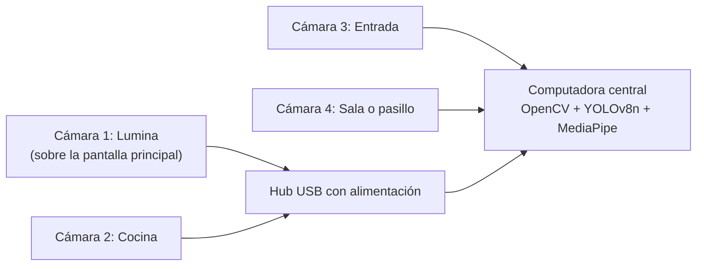
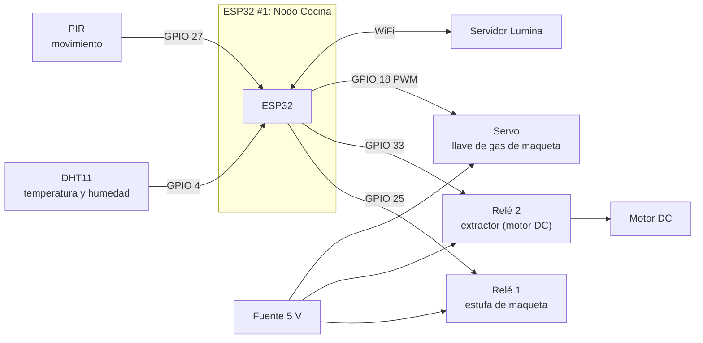
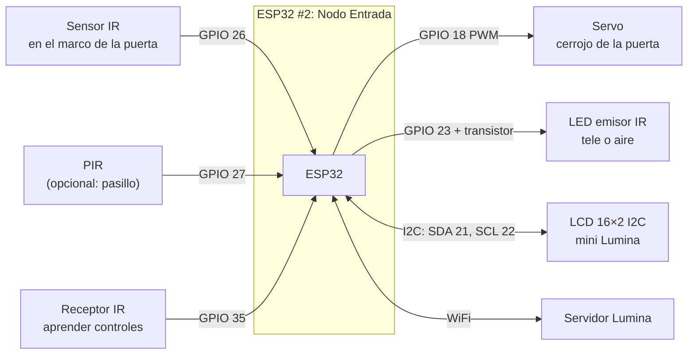
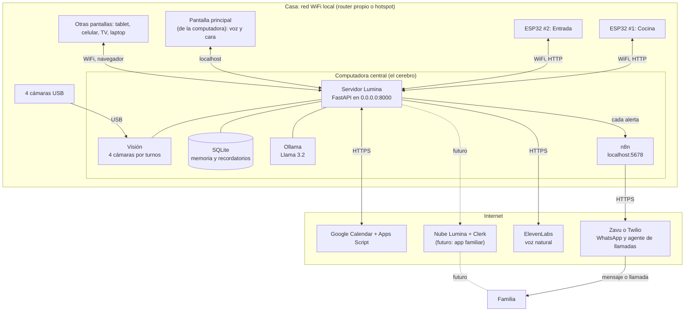
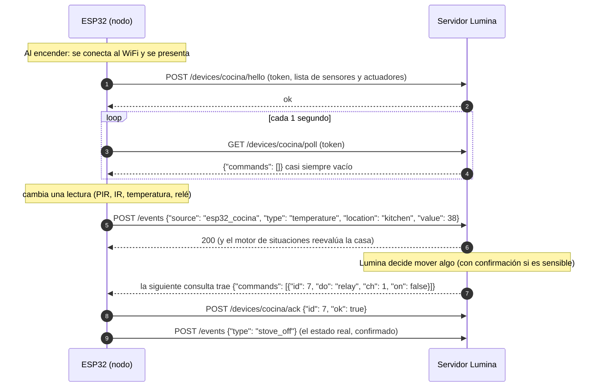
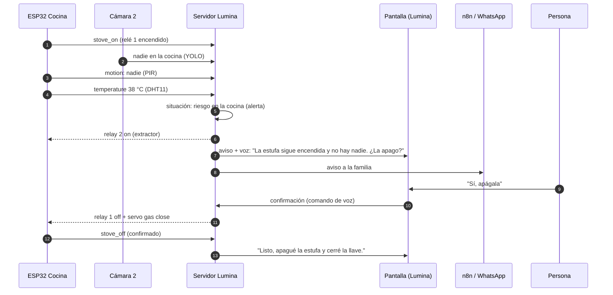
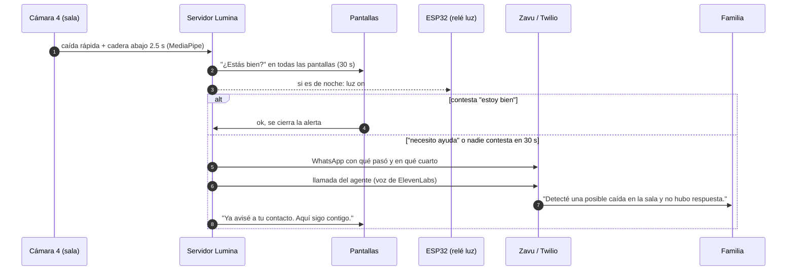
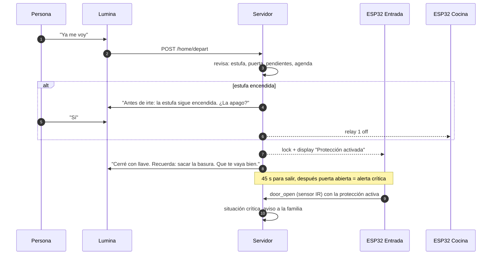
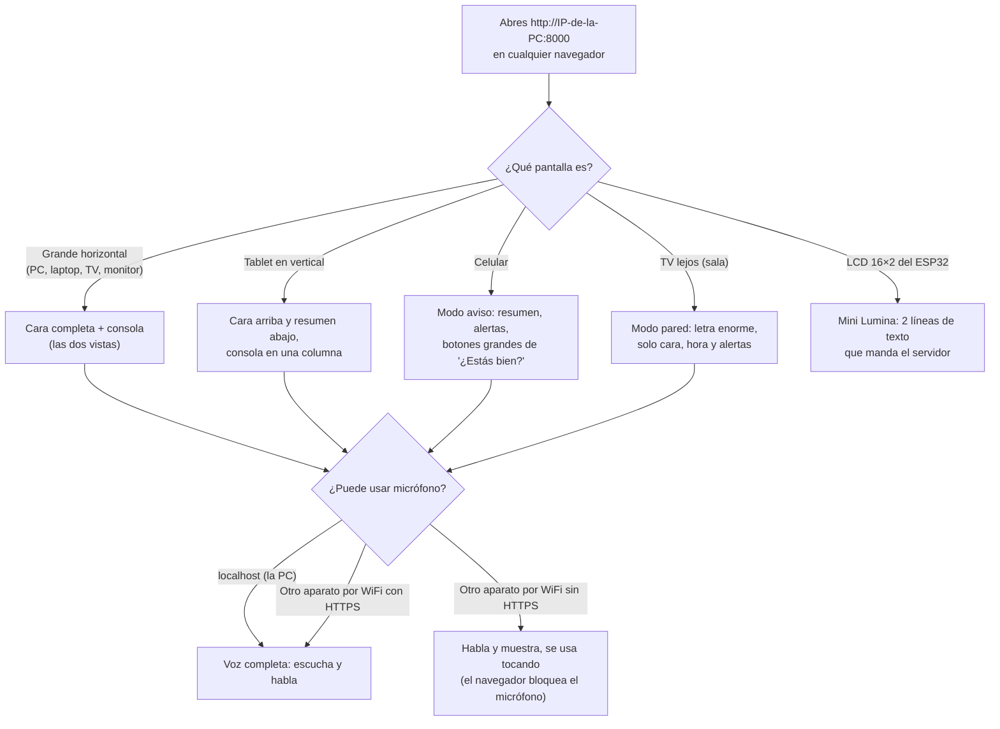

# Lumina: hardware, funciones y comunicación

Cómo se conecta cada pieza del hardware disponible, qué función de Lumina
habilita y cómo viajan los mensajes entre ellas. Los diagramas son **Mermaid**:
GitHub y VS Code (vista previa de Markdown) los muestran como diagramas.

**Estados:** **Disponible** = ya funciona · **Por construir** = hay que
programarlo o armarlo.

---

## 0. Las 3 ideas que ordenan todo

1. **Las cámaras van por USB a la computadora; los ESP32 van por WiFi.** Nada
   usa Bluetooth. La computadora es el **cerebro**: ve (cámaras), decide
   (reglas), recuerda (SQLite) y habla (Lumina). Los ESP32 son sus **manos y
   su piel**: sienten (temperatura, movimiento, puerta) y actúan (relés,
   servos, motores).
2. **Todo conversa por HTTP en la red WiFi de la casa.** Los ESP32 **mandan**
   lecturas (`POST /events`, que ya existe) y **preguntan** cada segundo si hay
   órdenes para ellos (`GET /devices/{nodo}/poll`, por construir). Así el
   servidor no necesita saber la IP de cada ESP32.
3. **Lumina se muestra en cualquier pantalla con navegador,** con el mismo
   servidor. La pantalla principal (la de la computadora) tiene voz y micrófono.
   Las demás (tablet, celular, TV, laptop) entran por WiFi. Incluso la LCD de
   16×2 muestra un resumen.

---

## 1. Inventario y qué hace cada pieza

| Hardware | Cant. | Dónde va | Qué hace en Lumina |
|---|---|---|---|
| **Cámara USB** | 4 | Computadora central | Ver: personas, objetos, puerta y caídas (una por zona, sección 2) |
| **ESP32** | 2 | Nodo Cocina y Nodo Entrada | Leer sensores y mover actuadores; hablar con el servidor por WiFi |
| **DHT11** (temperatura y humedad) | 1 | Nodo Cocina | Temperatura de la cocina: sube el riesgo si la estufa se queda prendida |
| **Sensor PIR** (movimiento) | 1 | Nodo Cocina | ¿Hay alguien en la cocina? (confirma lo que ve la cámara) |
| **Sensor IR** (obstáculo o proximidad) | 1 | Nodo Entrada, en el marco de la puerta | Puerta abierta o cerrada, o alguien cruzando |
| **Infrarrojos** (emisor y receptor)¹ | — | Nodo Entrada, apuntando a la tele o el aire | "Lumina, apaga la tele": aprende y repite códigos del control remoto |
| **Módulo de relés** | 1 | Nodo Cocina | Canal 1: "estufa" de la maqueta. Canal 2: luz o extractor |
| **Servos** | 2+ | Uno en cada nodo | Cocina: "llave de gas" de la maqueta. Entrada: cerrojo de la puerta |
| **Motores DC** | 1–2 | Nodo Cocina (por el relé canal 2) | Extractor o ventilador cuando sube la temperatura |
| **LCD I2C** (opcional) | 1 | Nodo Entrada | "Mini Lumina": "Protección activada", "Bienvenido", temperatura |
| **Fuente de 5 V y 3.3 V + reguladores** | — | Alimenta los nodos | 5 V: relés, servos, motores y LCD. Los ESP32 por USB o VIN. **Tierra común** |

¹ Supuse que "infrarrojos" es un **LED emisor IR + un receptor** (tipo control
remoto) y que "sensor IR" es un **sensor de obstáculo o proximidad**. Si es
otra cosa, se cambia solo esa fila.

**Recomendado comprar** (barato, y el documento maestro ya lo contempla):
- **Sensor MQ-2** (humo o gas) y **sensor de flama**: hoy la estufa se "sabe"
  por el relé que la alimenta más la temperatura. Con estos se detectaría
  también fuego real.
- Un **hub USB con alimentación propia**, para las 4 cámaras.

---

## 2. Las 4 cámaras

| Cámara | Qué detecta | Función |
|---|---|---|
| **1: Lumina** | Persona frente a la pantalla, caídas en ese cuarto, objetos | **Lumina te mira** (sus ojos siguen a la persona), te saluda al acercarte; caídas; búsqueda |
| **2: Cocina** | Personas, objetos, caídas | Estufa sin nadie (junto con PIR y DHT11); caídas en la cocina |
| **3: Entrada** | Puerta abierta o cerrada (por imagen), quién entra o sale | Casa vacía con puerta abierta; modo protección; complementa al sensor IR |
| **4: Sala o pasillo** | Personas, objetos, caídas | Caídas donde más ocurren; buscar objetos en otro cuarto |

**Para que 4 cámaras funcionen en una sola computadora:**
- **640×480 en MJPEG** por cámara. En HD saturan el USB y la segunda o tercera
  cámara ya no abre.
- Repartirlas en **puertos distintos** (a ser posible en controladores USB
  distintos) o usar un hub con alimentación.
- **Analizar por turnos:** cada cámara se procesa unas 3 veces por segundo, no
  30. Alcanza para caídas y objetos, y el CPU aguanta.
- **Video en vivo** solo de la cámara que se está viendo en la consola.
- **16 GB de RAM** recomendados (YOLO + MediaPipe + Ollama + n8n + navegador).

> **Por construir:** hoy el código maneja **una** cámara (`CAMERA_INDEX`).
> Hay que pasar a una lista de cámaras con su zona. El motor de situaciones ya
> recibe la zona en cada evento (`location`), así que no cambia.

---

## 3. Los dos nodos ESP32

### 3.1 Nodo Cocina (ESP32 #1)

| Pieza | Pin ESP32 | Alimentación | Evento o comando |
|---|---|---|---|
| DHT11 (datos) | GPIO 4 | 3.3 V | Manda `temperature` (zona `kitchen`) cada 30 s o si cambia 1 °C o más |
| PIR | GPIO 27 | 5 V (su salida es de 3.3 V) | Manda `motion` (`person_present` verdadero o falso) al cambiar |
| Relé 1: estufa | GPIO 25 | 5 V | Orden `relay 1 on/off`. **Manda `stove_on` / `stove_off`** con su estado real |
| Relé 2: extractor | GPIO 33 | 5 V | Orden `relay 2 on/off` (se prende solo si la temperatura sube) |
| Servo: llave de gas | GPIO 18 | 5 V de la fuente | Orden `servo gas close/open` |

### 3.2 Nodo Entrada (ESP32 #2)

| Pieza | Pin ESP32 | Alimentación | Evento o comando |
|---|---|---|---|
| Sensor IR (puerta) | GPIO 26 | 3.3 V | Manda `door_open` / `door_closed` al cambiar |
| PIR (opcional) | GPIO 27 | 5 V | Manda `motion` (zona `entrance`) |
| Servo: cerrojo | GPIO 18 | 5 V de la fuente | Orden `lock` / `unlock` |
| LED emisor IR | GPIO 23 (con transistor y resistencia) | 5 V | Orden `ir send tv_power` |
| Receptor IR | GPIO 35 (solo entrada) | 3.3 V | Modo "aprender": guarda el código del control |
| LCD I2C | SDA 21, SCL 22 | 5 V (usar convertidor de nivel si falla) | Orden `display "linea 1" "linea 2"` |

**Reglas eléctricas (importantes)**
- Motores, servos y relés **nunca** se alimentan desde los pines del ESP32:
  van a la fuente de 5 V, con **tierra común** con el ESP32.
- El motor DC va a través del relé (o de un driver) y con un **diodo** en
  paralelo.
- **No usar los pines 0, 2, 12 ni 15** (afectan el arranque). Los pines 34–39
  son solo de entrada.
- ⚠️ **Maqueta, no casa real:** el relé "estufa" debe prender una carga de 5 o
  12 V (un LED o una tira de luz que la represente), **nunca 110 V ni gas real**.
  La "llave de gas" es un servo de demostración.

---

## 4. La red completa

**Qué cambia para que esto funcione** (por construir):
- **El servidor escucha en la red, no solo en la computadora:** `0.0.0.0:8000`,
  configurable en `.env`. Windows preguntará si se permite en el firewall:
  "red privada, permitir".
- **Token para los ESP32:** cada nodo manda `X-Lumina-Token` en cada
  petición, para que otro aparato de la red no pueda mover el cerrojo.
- **IP fija para la computadora** (reservada en el router) o usar
  `lumina.local` (mDNS). Así los ESP32 siempre la encuentran.
- **Qué NO sale de la casa:** video, lecturas de sensores y órdenes a los
  ESP32. **Qué sí sale:** avisos de texto, eventos de calendario y audio de voz.

---

## 5. Cómo hablan los ESP32 con Lumina

**Por qué así (y no MQTT ni Bluetooth):**
- **HTTP ya existe en el servidor:** `POST /events` es el mismo contrato que
  usa la cámara.
- Que **el ESP32 pregunte** evita tener que conocer su IP; funciona aunque el
  router se la cambie.
- **Un segundo de retraso** basta para relés y cerrojos.
- **Si un nodo deja de preguntar por 10 s,** la consola lo marca como
  "desconectado" y **no inventa lecturas**: pasan a "Sin verificar".
- **Bibliotecas del firmware** (Arduino IDE o PlatformIO): `WiFi`,
  `HTTPClient`, `ArduinoJson`, `DHT sensor library`, `ESP32Servo`,
  `LiquidCrystal_I2C` e `IRremoteESP8266`.

---

## 6. Las funciones, al 100% con este hardware

| Pilar | Función | Hardware | Estado |
|---|---|---|---|
| **Casa Segura** | Estufa encendida sin nadie: alerta o crítica según la temperatura | Relé 1 (estado de la estufa) + DHT11 + PIR + cámara 2 | Reglas **disponibles**; nodo por construir |
| | **"¿Apago la estufa?"**: con tu "sí", corta el relé y cierra la llave de gas | Relé 1 + servo cocina | Por construir |
| | Extractor automático si la cocina pasa de 35 °C | Relé 2 + motor DC + DHT11 | Por construir |
| | Puerta abierta con la casa vacía | Sensor IR + cámara 3 | Reglas **disponibles**; nodo por construir |
| | **"Salgo de casa":** protege, **cierra el cerrojo** y la LCD dice "Protección activada" | Servo cerrojo + LCD + voz | Salida **disponible**; cerrojo por construir |
| | Alguien entra con la protección activa: aviso al instante | Sensor IR + PIR + cámara 3 | Regla **disponible**; nodo por construir |
| **Cuida** | Caídas en 3 cuartos (Lumina, cocina, sala) | Cámaras 1, 2 y 4 + MediaPipe | Detector **disponible** (1 cámara); multicámara por construir |
| | "¿Estás bien?", respuesta por voz, aviso automático, "me caí" | Pantalla + micrófono | **Disponible** |
| | **De noche, al detectar una caída, prende la luz** | Relé 2 (o un relé extra con luz) | Por construir |
| | Llamada del agente / WhatsApp a la familia | Zavu (o Twilio) + ElevenLabs | Por construir |
| **Control** (nuevo) | "Lumina, prende o apaga la luz / el ventilador" | Relés + motor DC | Por construir |
| | **"Lumina, apaga la tele"** (aprende el control) | Emisor y receptor IR | Por construir |
| | "Lumina, cierra con llave" (pide confirmación) | Servo cerrojo | Por construir |
| | "¿Qué temperatura hace en la cocina?" | DHT11 | Por construir (el dato ya se guarda) |
| **Memoria** | "Busca mi mochila" **en las 4 cámaras** y dice en qué cuarto está | 4 cámaras + YOLO | Búsqueda **disponible** (1 cámara); multicámara por construir |
| **Presencia** | **Lumina te mira** (los ojos siguen a la persona) y te saluda al acercarte | Cámara 1 + YOLO | Por construir |
| | Mini Lumina en la LCD 16×2 | LCD I2C | Por construir |
| **Escudo, Agenda, Contigo** | Igual que en `PRODUCTO.md` (no necesitan hardware) | — | Ver `PRODUCTO.md` |

**Regla para todo lo que mueve algo físico** (documento maestro: "las
acciones sensibles requieren confirmación"):
- **Siempre pregunta antes:** apagar la estufa, cerrar la llave, cerrar el
  cerrojo, prender o apagar aparatos por voz.
- **Sin preguntar:** prender el extractor por temperatura y la luz ante una
  caída de noche, porque no quitan nada y ayudan.
- **Todo queda en la bitácora.**

---

## 7. Tres escenas completas (quién le habla a quién)

### 7.1 Estufa olvidada

### 7.2 Caída

### 7.3 Salgo de casa

---

## 8. Lumina en cualquier pantalla

**Cómo se adapta:**
- **Por tamaño y orientación, solo:** ya hay versiones para 1024, 720, 560 y
  480 px de ancho. Faltan el **vertical** (tablets y celulares parados) y el
  **modo pared** para TV (letra más grande para verse de lejos).
- **Por modo, en la dirección:** `?modo=cara`, `?modo=consola`, `?modo=aviso` o
  `?modo=pared`. Así cada pantalla de la casa arranca como conviene.
- **Todas ven lo mismo al mismo tiempo:** todas consultan el mismo servidor.
  Una caída muestra "¿Estás bien?" en todas, y cualquiera puede responder.
- **El micrófono fuera de la PC:** Chrome y Edge **solo dan el micrófono** en
  `localhost` o con **HTTPS**. Para que una tablet escuche, el servidor debe
  servir HTTPS en la red (certificado local con `mkcert`). Sin eso, la tablet
  funciona igual, pero se usa tocando.
- **La LCD 16×2:** el servidor le manda el titular del resumen recortado a 16
  caracteres por línea.

---

## 9. Qué construir y en qué orden

| # | Qué | Dónde | Por qué primero |
|---|---|---|---|
| 1 | Servidor en la red (`0.0.0.0`) + token de dispositivos + IP fija | `server.py`, `.env` | Sin esto nada externo puede hablarle |
| 2 | `hello`, `poll` y `ack` de dispositivos + cola de órdenes + "desconectado" | `backend/devices.py`, `api.py` | Canal de ida y vuelta con los ESP32 |
| 3 | Firmware del **Nodo Cocina** (DHT11, PIR, relés, servo) | `firmware/nodo_cocina/` | Es la demo principal: la estufa |
| 4 | Comandos "¿La apago?" con confirmación por voz y botón | `voice-commands.js`, `lumina.js`, consola | Cierra el ciclo percibir → entender → actuar |
| 5 | Firmware del **Nodo Entrada** (IR puerta, servo cerrojo, LCD) | `firmware/nodo_entrada/` | Salir de casa y protección |
| 6 | **Multicámara** (4 zonas, por turnos, 640×480) | `backend/vision.py` | Caídas y búsqueda en toda la casa |
| 7 | Pantallas: vertical, `?modo=`, modo pared | `web/*.css`, `app-shell.js` | Cualquier pantalla |
| 8 | HTTPS en la red (`mkcert`) | `server.py` | Voz en tablets y celulares |
| 9 | Lumina te mira + control por IR (tele) | `vision.py`, `lumina.js`, nodo entrada | Momentos "wow" de la demo |
| 10 | Zavu (WhatsApp y agente de llamadas) + ElevenLabs | `integrations.py` | En cuanto haya documentación o credenciales |

**Maqueta sugerida para la demo:**
- Una **cocina** con la "estufa" (LED o tira de luz en el relé 1), el DHT11,
  el PIR y el ventilador (motor DC).
- Una **puerta** con el sensor IR en el marco, el servo como cerrojo y la LCD.
- Las **cámaras** apuntando a la cocina, la puerta y la "sala".
- La **pantalla de Lumina** al frente, con la cámara 1 encima.
- Para subir la temperatura en vivo: una secadora de pelo cerca del DHT11.
