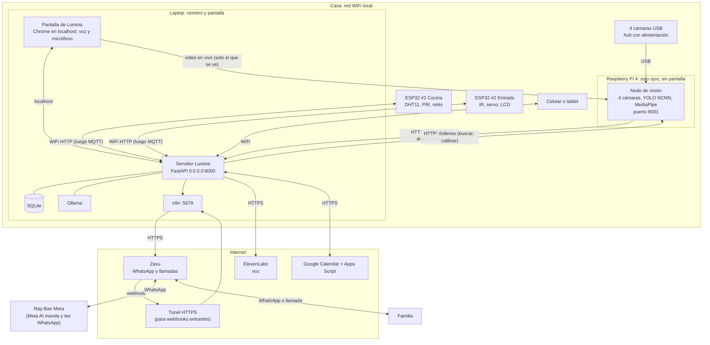
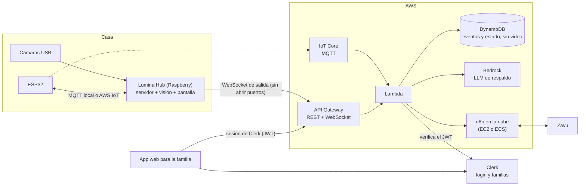
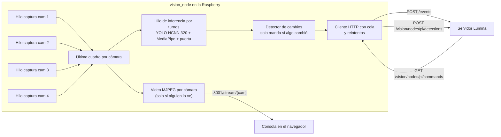
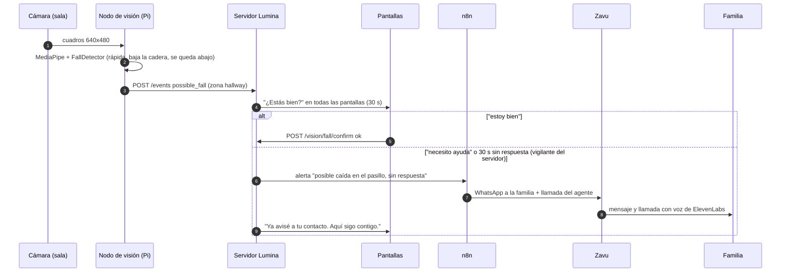
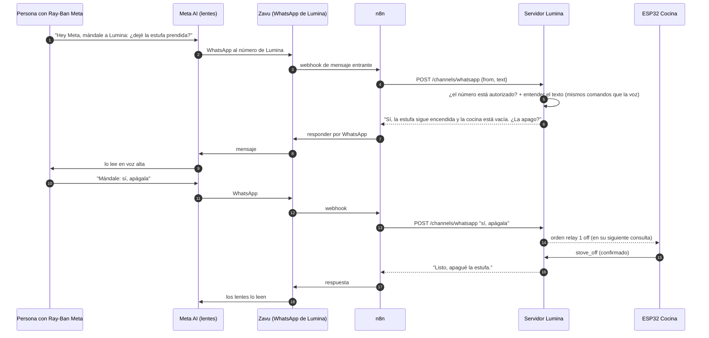
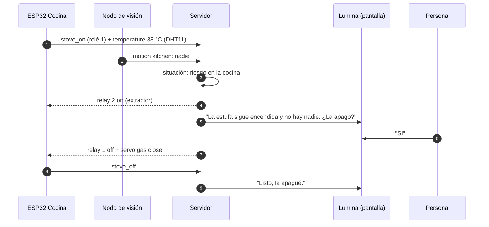

# Lumina (Super Alexa): plan maestro

Estado real del proyecto, hacia dónde va, y **cada** comunicación e
integración: Raspberry Pi con 4 cámaras, ESP32, ElevenLabs, Zavu, n8n, AWS y
Clerk. Es el documento para retomar el trabajo en cualquier computadora o
sesión de Claude Code.

Los diagramas son **Mermaid** y se ven como diagramas en GitHub.

**Estados:** **Hecho** (funciona y tiene pruebas) · **Listo para activar**
(el código existe, falta una cuenta o clave) · **Por hacer**.

**Otros documentos:**
- `CLAUDE.md`: reglas para Claude Code.
- `README.md`: cómo usarlo y comandos de voz.
- `ARQUITECTURA.md`: hardware y pines.
- `PRODUCTO.md`: planes y anuncio.
- `DISENO.md`: marca y animación.
- `TECNOLOGIAS.md`: librerías.
- `docs/SUPER_ALEXA_INNOVATHON_2026.md`: el reto original.
- Los **datos privados** van en `SUPER_ALEXA_PRIVADO.md`, que **no** está en
  el repositorio.

---

## 1. El diferenciador

En el hackathon hay otro equipo con un sistema de monitoreo **enfocado en
pacientes**. Lumina **no compite ahí**.

> **Ellos vigilan a un paciente. Lumina entiende la casa, actúa por ti y te
> acompaña fuera, en tus lentes.**

| | Monitoreo de pacientes | **Lumina** |
|---|---|---|
| Qué observa | Una persona y su salud | **La casa completa**: cocina, puerta, cuartos, objetos |
| Qué hace | Monitorea y avisa | **Entiende el contexto y actúa**: "¿Apago la estufa?" → el relé la apaga |
| Dónde vive | En el cuarto | **En casa y contigo**: pantalla, WhatsApp y **Ray-Ban Meta** |
| Qué previene | Emergencias de salud | **La vida diaria**: estufa olvidada, puerta abierta, **extorsión**, objetos perdidos |
| Privacidad | — | **El video no sale de casa**: se procesa en la Raspberry |

**Las 3 escenas del pitch** (en este orden):
1. **La casa que actúa:** la estufa sigue encendida, la cocina está vacía y la
   temperatura sube. Lumina pregunta "¿La apago?" y **el relé la apaga**.
2. **La casa en tus lentes:** fuera de casa, *"Hey Meta, mándale un WhatsApp a
   Lumina: ¿dejé la estufa prendida?"*. Lumina contesta por WhatsApp y los
   lentes lo leen. *"Apágala"* y se apaga.
3. **Escudo anti-extorsión:** "analiza este mensaje: deposita ya o le pasa algo
   a tu hijo" → riesgo alto, con sus señales.

**Caídas** y agenda quedan como "y además…", no en el titular.

---

## 2. Qué ya está hecho

Repositorio público: https://github.com/MarioMendez-123/hackaton · **147
pruebas pasan** (`python -m pytest -q`).

### 2.1 Servidor (Python / FastAPI)

| Módulo | Qué hace | Estado |
|---|---|---|
| `server.py` | Carga `.env`, monta todo, sirve la web, `no-cache`, arranca el vigilante de caídas. Escucha en `127.0.0.1:8000` | Hecho |
| `backend/events.py` + `memory.py` | Contrato de eventos (`EventIn`) + historial en SQLite (`events.db`) | Hecho |
| `backend/agent.py` | Estado de la casa + situaciones: estufa sin nadie (alerta o crítica), puerta abierta con casa vacía (5 min), puerta con protección (45 s para salir), caída (asking → ok / help / escalated) | Hecho |
| `backend/api.py` | 31 endpoints (lista en la sección 6.1) + `check_fall_escalation` + vigilante en un hilo | Hecho |
| `backend/briefing.py` | Resumen de la casa en una frase; frases de salida y llegada (riesgos, pendientes, agenda) | Hecho |
| `backend/reminders.py` | Recordatorios al salir, al llegar o cuando sea | Hecho |
| `backend/vision.py` | **Una** webcam: YOLOv8n (personas y 12 objetos, etiquetas en español), puerta por diferencia de imagen, `FallDetector` con MediaPipe Pose (rápida + baja la cadera + se queda abajo), video MJPEG | Hecho (1 cámara) |
| `backend/calendar_provider.py` | Leer Google Calendar por URL secreta iCal (varias URLs, eventos que se repiten) | Hecho |
| `backend/calendar_writer.py` | "Agenda dentista mañana a las 5": entiende fechas en español. Crea el evento por Apps Script (reintentos con `requestId` para no duplicar) o devuelve un enlace "toca Guardar" | Hecho |
| `backend/integrations.py` | Avisos: n8n (**activo**), Telegram (listo para activar), WhatsApp y llamadas Twilio (listo para activar), simulados | Hecho |
| `backend/contacts.py` | Contacto de emergencia (`contacts.json`) | Hecho (falta el archivo) |
| `backend/fraud_detector.py` | Anti-extorsión: urgencia, dinero, amenaza, secreto, familiar falso. **Nunca afirma que es estafa** | Hecho |
| `lumina.py` | `/lumina/ask`: respuestas fijas → "¿dónde dejé…?" → agenda → **Ollama** (`llama3.2:1b`). `/lumina/speak`: **ElevenLabs** (responde 501 si no hay clave) | Hecho |

### 2.2 Interfaz (HTML / CSS / JS sin frameworks)

| Parte | Qué hace | Estado |
|---|---|---|
| Cara de Lumina | 10 expresiones, parpadeo, mirada, boca sincronizada, subtítulos palabra por palabra, reloj, estado de voz, resumen de la casa, sugerencias | Hecho |
| Consola | Cámara con rótulos, plano animado, lecturas, bitácora, agenda con "Agendar", recordatorios, anti-extorsión, canales, protección | Hecho |
| Voz | Web Speech (es-MX), la palabra "Lumina", más de 30 comandos (`voice-commands.js`, probado con 85 frases), "me caí" y "auxilio" | Hecho |
| "¿Estás bien?" | Aviso en toda la pantalla, 30 s, voz, recordatorio a la mitad, respuesta hablada, aviso automático del servidor | Hecho |
| Sistema de diseño | `tokens.css`: "la casa de noche", OKLCH, Newsreader + Schibsted Grotesk, reglas de animación y accesibilidad | Hecho |
| Pantallas | Se adapta a 1024, 720, 560 y 480 px | Parcial (faltan el vertical, `?modo=` y el modo pared) |

### 2.3 Servicios que ya funcionan

- **n8n local** (`localhost:5678`), con el flujo "Super Alexa - Alertas"
  (webhook `superalexa-alert`). Exportado en `n8n/superalexa-alertas.json`.
- **Google Calendar:** lectura por iCal y **escritura por Apps Script**
  (`apps_script_calendario.gs`, con token, candado y caché).
- **Ollama** con `llama3.2:1b`.

### 2.4 Lo que todavía NO existe (lo cubre este plan)

- Raspberry Pi con **4 cámaras**.
- ESP32 (firmware y canal de ida y vuelta).
- Relés y actuadores.
- WhatsApp de entrada (Zavu).
- Agente de llamadas.
- Clave de ElevenLabs.
- AWS (IoT Core, Lambda, API Gateway).
- Clerk y la app para la familia.
- HTTPS en la red.
- Integración con los Ray-Ban Meta (por WhatsApp).

---

## 3. Arquitectura objetivo

### 3.1 Topología para el hackathon (recomendada con **Raspberry Pi 4**)

La **Raspberry Pi 4** hace **solo de "ojos"**: las 4 cámaras, sin pantalla,
para que todo su procesador vaya a la detección. La **laptop** hace de
"cerebro" (servidor, Ollama y n8n) **y de pantalla de Lumina**. Como la abre
en `localhost`, el **micrófono funciona sin configurar HTTPS**.



**No recomendado con la Pi 4:** poner también el servidor y la pantalla de
Lumina en la Pi. Chromium con las animaciones de la cara, más YOLO y MediaPipe,
satura el procesador y la temperatura. Si la pantalla física **tiene** que ir
conectada a la Pi, se abre en **modo ligero** (`?modo=ligero`, por hacer: sin
fondo de estrellas, sin desenfoques ni animaciones en bucle).

### 3.2 Topología de producto (después del hackathon)



**Regla de privacidad que no se rompe:** el **video nunca sale del Hub**. A la
nube solo van eventos de texto (tipo, zona, hora), estado y avisos.

---

## 4. Raspberry Pi: detección con 4 cámaras al mismo tiempo

### 4.1 Hardware y sistema

| Qué | Recomendado |
|---|---|
| Placa | **Raspberry Pi 4 (la que tenemos)**. **4 GB como mínimo**, ideal 8 GB. Con 2 GB, bajar a 2 cámaras |
| Sistema | Raspberry Pi OS **64 bits** (Bookworm, Python 3.11). **No** el de 32 bits: YOLO y MediaPipe necesitan ARM64. Versión **Lite** (sin escritorio) para ahorrar memoria |
| Enfriamiento | **Disipador + ventilador obligatorios.** La Pi 4 baja su velocidad a los 80 °C, y con 4 cámaras llega |
| Fuente | Oficial USB-C de **5 V / 3 A** (15 W). Si es más débil aparece el rayo de "bajo voltaje" y todo se traba |
| Cámaras | 4 webcams USB en un **hub con fuente propia**. **La Pi 4 solo da 1.2 A en total a sus puertos USB**: no alcanza para 4 cámaras sin hub. Repartir 2 en los USB 3.0 (azules) y 2 en los USB 2.0 |
| Almacenamiento | microSD A2 de 32 GB o más |
| Pantalla | **Ninguna** (la cara de Lumina va en la laptop). Se administra por SSH |

### 4.2 Estrategia de rendimiento (la clave para 4 cámaras)

Una **Pi 4** corre YOLO a unas **3 a 5 inferencias por segundo en total**,
no 30. Para 4 cámaras se aguanta así:

| Técnica | Valor |
|---|---|
| Captura | **640×480 en MJPEG** (`cv2.CAP_PROP_FOURCC = MJPG`) y **a 10 cuadros por segundo** (`CAP_PROP_FPS = 10`): menos USB y menos trabajo para descomprimir |
| **Solo analizar si algo se mueve** (clave en la Pi 4) | Una diferencia de imagen muy barata (160×120 en gris) decide qué cámara tiene movimiento. YOLO solo corre ahí, más una revisión de cada cámara cada 5 s aunque no se mueva nada. Casi siempre la escena está quieta: el procesador alcanza para las 4 |
| Un hilo de captura **por cámara** | Solo guarda el último cuadro (buffer de 1). Nunca se atrasa |
| **Un solo hilo de inferencia por turnos** | Recorre las 4 cámaras. Cada una se analiza **1 o 2 veces por segundo** |
| YOLO optimizado | Exportar `yolov8n` a **NCNN** (`yolo export model=yolov8n.pt format=ncnn imgsz=320`): de 2 a 4 veces más rápido que PyTorch en la Pi. Entrada de **320** (o 256 si falta velocidad), no 640 |
| MediaPipe (caídas) | **Solo en la cámara donde YOLO acaba de ver a una persona**, y de una en una (la Pi 4 no aguanta pose en 4 a la vez), a unos 2 o 3 cuadros por segundo mientras la persona siga ahí |
| Hilos | `cv2.setNumThreads(1)` en los hilos de captura; YOLO y MediaPipe usan los 4 núcleos |
| Puerta por imagen | Solo en la cámara de la entrada; es muy barato (diferencia de grises) |
| Video en vivo | Se codifica solo **si alguien lo está viendo**, y a unos 5 cuadros por segundo |
| **Ojo** | 4 cámaras en un solo puerto USB 2.0 no abren. Repartirlas entre los puertos USB 3.0 (azules) |

**Esperado en una Pi 4 con NCNN a 320** (estimado; se mide al instalar):
- **YOLO:** entre 200 y 350 ms por inferencia, o sea **3 a 5 por segundo en
  total**. Con "solo si se mueve", la cámara donde hay acción se analiza unas
  **2 o 3 veces por segundo** y las quietas cada 5 s.
- **MediaPipe (pose lite):** unos 60 a 100 ms, en una cámara a la vez.
- **Uso:** procesador al 70–90 %, temperatura por debajo de 75 °C **con
  ventilador**.
- **Alcanza para:** personas, puerta, objetos y caídas.
- **No alcanza para:** video fluido de las 4 cámaras a la vez. La consola
  muestra en vivo solo la que se está viendo, a 3–5 cuadros por segundo.

**Si aun así no alcanza** (se mide con el latido, que reporta los cuadros por
segundo y la temperatura):
- bajar YOLO a 256;
- caídas solo en 2 cámaras;
- **2 cámaras en la Pi y 2 en la laptop** (la laptop ya tiene su visión en
  `backend/vision.py`).

### 4.3 Configuración de cámaras (`cameras.json`, en la Pi)

```json
[
  { "id": "lumina",  "device": 0, "zone": "livingroom", "tasks": ["people", "objects", "falls", "gaze"] },
  { "id": "cocina",  "device": 2, "zone": "kitchen",    "tasks": ["people", "objects", "falls"] },
  { "id": "entrada", "device": 4, "zone": "entrance",   "tasks": ["people", "door"] },
  { "id": "sala",    "device": 6, "zone": "hallway",    "tasks": ["people", "objects", "falls"] }
]
```

- En Linux cada webcam crea **dos** `/dev/videoN` (el par es el bueno).
  Listarlas con `v4l2-ctl --list-devices`.
- Para que el número no cambie al reconectar, usar la ruta fija de
  `/dev/v4l/by-path/…` en lugar del número.

### 4.4 El nodo de visión (por hacer: `vision_node/`)

Es un proceso aparte, `vision_node/main.py`, que **reutiliza** lo que ya está
probado en `backend/vision.py`: `FallDetector`, las etiquetas en español, la
puerta por diferencia y la búsqueda. La lógica se mueve a funciones puras
compartidas, para no duplicar.



**Qué manda y cuándo** (solo cambios, nunca cada cuadro):

| Detección | Evento que ya entiende el servidor | Cuándo se manda |
|---|---|---|
| Hay o no hay personas en la zona | `motion` + `metadata.person_present` + `location` = zona | Al cambiar, estable al menos 2 s |
| Puerta abierta o cerrada | `door_open` / `door_closed` (cámara de entrada) | Al cambiar |
| Posible caída | `possible_fall` + `location` | Cuando `FallDetector` dispara (el servidor pregunta "¿Estás bien?") |
| Objeto encontrado en una búsqueda | `object_detected` + `metadata.object` + `location` | Al encontrarlo |
| Lo que ve cada cámara | `POST /vision/nodes/pi/detections` `{cam: [{label, conf, box}]}` | Cada 1 s (para el "Veo: …" de la consola y "Lumina te mira") |
| Latido | `POST /vision/nodes/pi/heartbeat` `{cams_ok: 4, fps: {...}, temp_c}` | Cada 5 s (si deja de llegar: "cámaras desconectadas") |

**Qué recibe** (el nodo pregunta por órdenes cada segundo):
`find {object}`, `cancel_find`, `calibrate_door {cam}`, `snapshot {cam}` (solo
local).

### 4.5 Cambios en el servidor para el nodo (por hacer)

1. **Escuchar en la red:** `LUMINA_HOST=0.0.0.0` en `.env` y usarlo en `server.py`.
2. **Token de dispositivos:** `DEVICE_TOKEN` en `.env`. Los nodos lo mandan
   en `X-Lumina-Token`, y se rechaza sin él.
3. **Nuevo `backend/nodes.py`:**
   - registro de nodos (Pi y ESP32), latido, cola de órdenes;
   - `POST /vision/nodes/{id}/detections|heartbeat`,
     `GET /vision/nodes/{id}/commands`, `POST /vision/nodes/{id}/ack`.
4. **La búsqueda** ("busca mi mochila") se manda al nodo como orden. La
   respuesta dice **en qué cuarto** está.
5. **Consola:** 4 miniaturas de cámara (video desde `http://<pi>:8001/stream/<cam>`).
   Al tocar una se ve en grande.
6. **"Lumina te mira":** la cara recibe la posición x de la persona que ve la
   cámara `lumina` y mueve las pupilas hacia ella.

### 4.6 Instalar en la Raspberry (paso a paso)

```bash
# Raspberry Pi OS Lite 64 bits (Bookworm) · activar SSH con Raspberry Pi Imager
sudo apt update && sudo apt install -y python3-venv v4l-utils git libgl1
vcgencmd measure_temp && vcgencmd get_throttled   # temperatura y "bajo voltaje" (0x0 = bien)
git clone https://github.com/MarioMendez-123/hackaton.git lumina-agent && cd lumina-agent
python3 -m venv .venv && source .venv/bin/activate
pip install -r requirements.txt           # ultralytics trae torch para ARM64 (tarda: paciencia)
pip install ncnn                           # motor rápido para YOLO en la Pi
python -c "import mediapipe, ultralytics, cv2; print('ok')"   # si mediapipe no instala en ARM, caídas en la laptop
yolo export model=yolov8n.pt format=ncnn imgsz=320
v4l2-ctl --list-devices                    # ver qué /dev/video es cada cámara
# crear vision_node/cameras.json y .env (LUMINA_SERVER_URL, DEVICE_TOKEN)
python -m vision_node                      # cuando exista (sección 4.4)
```

**Arranque automático:** un servicio `systemd`, `lumina-vision.service`, con
reinicio si falla. La Pi 4 no lleva pantalla: se administra por SSH.

**Micrófono:** la cara de Lumina corre en la laptop (`localhost`), así que **no
hace falta HTTPS**. Solo haría falta si otra pantalla por la red quiere usar el
micrófono (`mkcert`, sección 8 de `ARQUITECTURA.md`).

**Pruebas del nodo** (por hacer): `FallDetector` y las etiquetas ya tienen
pruebas. Faltan: el turno de las 4 cámaras (con cámaras simuladas), el
detector de cambios (que no mande de más) y la cola con reintentos (que no se
pierda un evento si el servidor se reinicia).

---

## 5. Todas las comunicaciones

### 5.1 Tabla completa

| # | De → a | Protocolo y puerto | Autenticación | Qué viaja | Frecuencia | Estado |
|---|---|---|---|---|---|---|
| 1 | Cámaras → Raspberry | USB (UVC, MJPEG 640×480) | — | Video | Continuo | Por hacer (hoy: 1 cámara en la laptop) |
| 2 | Raspberry → Servidor | HTTP `:8000` `POST /events` | `X-Lumina-Token` | Eventos (personas, puerta, caída, objeto) | Al cambiar | Por hacer (el contrato existe) |
| 3 | Raspberry → Servidor | HTTP `POST /vision/nodes/pi/detections` y `heartbeat` | Token | Qué ve cada cámara; salud | 1 s / 5 s | Por hacer |
| 4 | Servidor → Raspberry | HTTP: la Pi pregunta `GET …/commands` | Token | Buscar, cancelar, calibrar | Cada 1 s | Por hacer |
| 5 | Navegador → Raspberry | HTTP `:8001/stream/{cam}` | Solo red local | Video MJPEG | Mientras se ve | Por hacer (hoy: `/vision/stream`) |
| 6 | ESP32 → Servidor | HTTP `POST /events` y `/devices/{id}/hello` | Token | Temperatura, movimiento, puerta, estado de relés | Al cambiar y cada 30 s | Por hacer |
| 7 | Servidor → ESP32 | HTTP: el ESP32 pregunta `GET /devices/{id}/poll` | Token | Relé, servo, LCD, infrarrojo | Cada 1 s | Por hacer |
| 7b | ESP32 ↔ AWS IoT Core | MQTT sobre TLS, puerto 8883 | Certificado X.509 por dispositivo | Temas `home/sensors/...`, `home/actions` | Al cambiar | Por hacer (fase 2) |
| 8 | Pantallas → Servidor | HTTP o HTTPS `:8000` | Local, sin login | Página, `/home/overview`, comandos | Cada 3 s (cada 1 s si hay caída) | Hecho (solo `localhost`) |
| 9 | Servidor → Ollama | HTTP `localhost:11434/api/chat` | — | Preguntas libres | Por pregunta | Hecho |
| 10 | Servidor → n8n | HTTP `localhost:5678/webhook/superalexa-alert` | — (local) | Cada alerta | Por alerta | **Hecho** |
| 11 | n8n → Zavu | HTTPS, API de Zavu | Clave de Zavu (en n8n) | WhatsApp de salida y llamadas | Por alerta | Por hacer |
| 12 | Zavu → n8n → Servidor | HTTPS webhook (por túnel o AWS) → `POST /channels/whatsapp` | Firma o secreto de Zavu + token | WhatsApp de entrada (texto o voz) | Por mensaje | Por hacer |
| 13 | Ray-Ban Meta ↔ WhatsApp | Meta AI en los lentes | Cuenta de WhatsApp del usuario | "Mándale a Lumina…" / leer la respuesta | Por uso | Por probar (sin código) |
| 14 | Servidor → ElevenLabs | HTTPS `api.elevenlabs.io/v1/text-to-speech/{voz}` | `xi-api-key` | Texto → audio MP3 | Por frase | **Listo para activar** |
| 15 | Servidor → Google | HTTPS: iCal (lectura) y Apps Script (`/exec`, escritura) | URL secreta + token propio | Eventos | Cada 60 s / por orden | **Hecho** |
| 16 | Servidor → Telegram | HTTPS `api.telegram.org/bot…/sendMessage` | Token del bot | Alertas | Por alerta | Listo para activar |
| 17 | Servidor → Twilio | HTTPS (SDK de Twilio) | SID + token | WhatsApp y llamada (respaldo de Zavu) | Por alerta | Listo para activar |
| 18 | Hub → AWS | WebSocket de salida (API Gateway) | Clave del dispositivo | Estado y eventos resumidos (sin video) | Continuo | Por hacer (fase 2) |
| 19 | App familiar → AWS | HTTPS (API Gateway) | **JWT de sesión de Clerk** | Ver estado, historial, mandar mensajes | Por uso | Por hacer (fase 2) |
| 20 | AWS → Bedrock / Polly | Llamadas internas de AWS | Rol IAM | LLM y voz de respaldo | Por uso | Opcional |

### 5.2 Caída detectada por la Raspberry



### 5.3 La casa en tus lentes (Ray-Ban Meta por WhatsApp)



### 5.4 La casa que actúa (la estufa)



---

## 6. Integraciones: estado y pasos exactos

### 6.1 Endpoints actuales (referencia)

- **Estado y eventos:** `POST /events` · `GET /state` · `GET /situation` ·
  `GET /events/recent` · `GET /memory/object`.
- **La casa:** `GET /home/overview` · `POST /home/protection` ·
  `POST /home/depart` · `POST /home/arrive` · `POST /alerts/escalate`.
- **Recordatorios:** `GET/POST /reminders` · `POST /reminders/{id}/done`.
- **Calendario:** `GET /calendar` · `POST /calendar/events`.
- **Canales y contactos:** `GET /integrations/status` · `GET /contacts`.
- **Visión:** `POST /vision/start|stop` ·
  `GET /vision/status|detections|objects|stream` ·
  `POST /vision/calibrate_door` · `POST /vision/find` ·
  `GET /vision/find/status` · `POST /vision/find/cancel` ·
  `POST /vision/fall/confirm`.
- **Anti-extorsión:** `POST /messages/analyze`.
- **Lumina:** `POST /lumina/ask` · `POST /lumina/speak`.

**Nuevos, por hacer:** `/vision/nodes/*` · `/devices/*` ·
`/channels/whatsapp` · `/webhooks/zavu` (si no pasa por n8n).

### 6.2 ElevenLabs (la voz de Lumina y del agente de llamadas)

| | |
|---|---|
| **Rol** | Voz natural de Lumina en la pantalla y voz del agente que llama a la familia |
| **Hecho** | `POST /lumina/speak` en `lumina.py` llama a `api.elevenlabs.io/v1/text-to-speech/{voz}` (modelo `eleven_multilingual_v2`). En la web, `speak()` intenta ElevenLabs primero y cae a la voz del navegador si responde 501. Los subtítulos siguen el avance del audio |
| **Variables** | `ELEVENLABS_API_KEY`, `ELEVENLABS_VOICE_ID` (hoy por defecto `21m00Tcm4TlvDq8ikWAM`, una voz en inglés), `ELEVENLABS_MODEL_ID` |

**Por hacer:**
1. Crear la clave y **elegir una voz en español de México** (en la biblioteca
   de voces) → `ELEVENLABS_VOICE_ID`.
2. **Caché de frases fijas** ("¿Estás bien?", "Listo, la apagué"): guardar el
   MP3 por texto para no pagar cada vez y responder al instante.
3. **Menos espera:** usar el endpoint de *streaming* y el modelo rápido
   (`eleven_flash_v2_5`) en las respuestas cortas.
4. **Agente de llamadas:** según lo que ofrezca Zavu:
   - **(a)** Zavu reproduce un audio. Generamos el MP3 con ElevenLabs y le
     pasamos la URL.
   - **(b)** Zavu tiene su propio agente de voz. Se le pasa el texto.
   - **(c)** Alternativa: el agente conversacional de ElevenLabs con
     telefonía (Twilio).
5. **Costos:** registrar los caracteres por día en la bitácora.

**Probar:** que `curl -X POST localhost:8000/lumina/speak -d '{"text":"hola"}'`
devuelva `audio/mpeg`. **Respaldo:** la voz del navegador (ya funciona) o AWS
Polly.

### 6.3 Zavu (WhatsApp y agente de llamadas)

| | |
|---|---|
| **Rol** | Canal principal con la familia y con los **Ray-Ban Meta**: WhatsApp de salida (avisos) y de entrada (preguntas y órdenes), más llamadas en emergencias |
| **Hecho** | Nada específico de Zavu (no hay documentación). **La estructura está lista:** `NotificationProvider` y `CallProvider` en `backend/integrations.py`. Twilio ya está programado como respaldo |
| **Lo que no sabemos** | Autenticación, formato de su API, si maneja plantillas de WhatsApp, si tiene agente de voz y cómo manda los mensajes entrantes (webhook). **Hay que revisarlo primero, en su documentación y con el equipo del evento** |

**Por hacer:**
1. Conseguir las credenciales y el número de WhatsApp de Zavu →
   `ZAVU_API_KEY`, `ZAVU_WHATSAPP_NUMBER` y lo demás en `.env`.
2. **Salida**, una de dos:
   - **(a) en n8n:** nodo HTTP hacia Zavu dentro del flujo "Super Alexa - Alertas";
   - **(b) en Python:** `ZavuWhatsAppProvider(NotificationProvider)` y
     `ZavuCallProvider(CallProvider)`, agregados a `_build_notifier` y `_build_caller`.
3. **Entrada:** Zavu → webhook público (túnel `cloudflared` o `ngrok` en el
   hackathon; API Gateway en producción) → n8n → `POST /channels/whatsapp` en
   el servidor.
4. **`POST /channels/whatsapp`** (nuevo):
   - verifica el secreto de Zavu **y** que el número esté en `contacts.json`
     (autorizados);
   - entiende el texto con **los mismos comandos que la voz** (hay que portar a
     Python las reglas de `voice-commands.js` que aplican: estado, estufa,
     apagar, protección, agenda, anti-extorsión);
   - responde un texto corto.
5. **Confirmar acciones por WhatsApp:** "¿La apago?" → "sí". Se guarda la
   pregunta pendiente por número, válida 2 minutos.
6. **Reglas de WhatsApp para empresas:** los mensajes que inicia la empresa
   suelen necesitar **plantillas aprobadas**; las respuestas dentro de 24 h,
   no. Confirmarlo con Zavu.

**Probar:** un WhatsApp desde el celular ("¿cómo está la casa?") debe tener
respuesta en menos de 10 s. Después, lo mismo desde los Ray-Ban Meta.
**Respaldo:** Twilio (sandbox de WhatsApp), ya programado.

### 6.4 n8n (el orquestador)

| | |
|---|---|
| **Rol** | Recibir cada alerta y repartirla (WhatsApp, Telegram, llamada); recibir los webhooks de afuera (Zavu) y pasarlos al servidor |
| **Hecho** | Instalado local (v2.40.6) y activo. Flujo **"Super Alexa - Alertas"**: webhook `POST /webhook/superalexa-alert` → nodo de código que registra y responde. Exportado en `n8n/superalexa-alertas.json`. El servidor le manda cada alerta (`N8N_WEBHOOK_URL`) |

**Por hacer:**
1. **Ramas del flujo de alertas:**
   - por severidad: `critical` → WhatsApp + llamada; `warning` → WhatsApp;
   - por tipo: una caída sin respuesta lleva el cuarto y la hora.
2. **Flujo nuevo "WhatsApp entrante":** webhook de Zavu → validar →
   `POST http://<servidor>:8000/channels/whatsapp` → responder por Zavu.
3. **Reintentos y registro de errores** en cada nodo HTTP.
4. **Acceso público** para los webhooks:
   - en el hackathon, un túnel (`cloudflared tunnel --url http://localhost:5678`);
   - en producción, n8n en AWS (EC2 o ECS) con HTTPS.
5. **Guardar las credenciales** (Zavu, Telegram) **en n8n**, no en el código.

**Probar:** `curl -X POST localhost:5678/webhook/superalexa-alert -d '{"situation":"prueba"}'`
debe responder `{"recibido": true…}` (**hoy ya responde así**).

### 6.5 AWS (infraestructura en la nube)

**Rol** (según el documento maestro): IoT Core para los ESP32 por MQTT,
Lambda, API Gateway, almacenamiento de eventos, servicios de IA y
autenticación. **Hoy no hay nada en AWS:** todo corre local, y así debe seguir
funcionando si AWS falla.

| Servicio | Para qué | Cuándo |
|---|---|---|
| **IoT Core** (MQTT) | ESP32 → temas `home/sensors/kitchen/temperature`, `home/sensors/kitchen/smoke`, `home/sensors/kitchen/flame`, `home/sensors/livingroom/motion`, `home/security/door`, `home/events`. Órdenes en `home/actions`. Cada ESP32 con **certificado X.509** | Fase 2 (en el hackathon, HTTP local) |
| **Regla de IoT → Lambda** | Pasar cada mensaje al Hub (o a DynamoDB) con el mismo formato de `EventIn` | Fase 2 |
| **API Gateway** (REST + WebSocket) | REST: webhooks públicos (Zavu) y la API de la app familiar. WebSocket: **el Hub se conecta hacia afuera** (sin abrir puertos del router) y recibe órdenes | Fase 2 |
| **Lambda** | Validar el JWT de Clerk, guardar eventos y pasar mensajes entre la app o Zavu y el Hub | Fase 2 |
| **DynamoDB** | Estado e historial **resumido** (sin video, sin imágenes) por casa | Fase 2 |
| **Bedrock** | Modelo de lenguaje de respaldo si la Pi no puede con Ollama | Opcional |
| **Polly** | Voz de respaldo si falla ElevenLabs | Opcional |
| **EC2 o ECS** | n8n en la nube con HTTPS | Fase 2 |
| **Región** | La más cercana a México, por latencia | — |

**Por hacer en código:**
- Un proveedor `AwsIotBridge` en el Hub que se suscribe a `home/actions` y
  publica los eventos; se activa con `AWS_IOT_ENDPOINT` y los certificados.
- `firmware/` con dos modos: `HTTP_LOCAL` y `AWS_IOT` (biblioteca
  `PubSubClient` o `MQTTClient`, con certificados guardados en el ESP32).

**Seguridad:** usuario IAM con permisos mínimos y certificados por
dispositivo. **Nada de video** en la nube.

### 6.6 Clerk (inicio de sesión y familias)

| | |
|---|---|
| **Rol** | Que la familia entre a la casa desde su celular: ver el estado, recibir avisos, mandar mensajes a la pantalla y administrar contactos. **La pantalla de la casa no pide login** |
| **Hecho** | Nada (hoy todo es local y sin cuentas) |
| **Depende de** | La nube (API Gateway + Lambda + WebSocket al Hub), sección 6.5 |

**Por hacer:**
1. **App web familiar** (puede ser otra página del mismo proyecto, servida
   desde la nube) con **Clerk**: registro, inicio de sesión y recuperación.
2. **Organizaciones de Clerk = hogares.** Roles: `owner` (dueño), `family`
   (familiar), `caregiver` (cuidador). Un usuario puede tener varias casas (plan Pro).
3. **Vincular una casa:** la pantalla muestra un **código de 6 dígitos** (o un
   QR). El dueño lo escribe en la app, y el Hub queda ligado a esa organización
   de Clerk.
4. **Backend:** cada llamada de la app lleva el **JWT de sesión de Clerk**.
   Lambda lo verifica con las llaves públicas de Clerk (JWKS) y revisa que el
   usuario pertenezca a la casa y qué rol tiene.
5. **Qué puede hacer cada rol:**
   - `family`: ver y mandar mensajes;
   - `caregiver`: también confirmar alertas;
   - `owner`: también contactos, protección y dispositivos.
6. **Variables:** `CLERK_PUBLISHABLE_KEY` (web), `CLERK_SECRET_KEY` (backend),
   `CLERK_JWKS_URL`.

**Probar:** un familiar inicia sesión, ve el resumen de **su** casa y **no**
puede ver otra.

### 6.7 Google Calendar

**Hecho:** lectura por iCal (varias URLs), escritura por Apps Script (token,
candado y caché contra duplicados), "abre mi calendario" en la cuenta correcta
(`authuser`).

**Por hacer:** editar y borrar eventos por voz; recordatorios con hora
(medicamentos).

### 6.8 Ollama o LLM

**Hecho:** `llama3.2:1b` local.

**Por hacer:** si el servidor pasa a la Raspberry, usar Bedrock o dejar Ollama
en la laptop.

### 6.9 Twilio y Telegram

Listos para activar con sus credenciales en `.env`. Son **el respaldo** si
Zavu no está disponible.

---

## 7. Plan de trabajo (en orden, pensado para horas)

| # | Tarea | Resultado para la demo | Depende de |
|---|---|---|---|
| 1 | Servidor en la red (`LUMINA_HOST`, `DEVICE_TOKEN`, IP fija) | La Pi y los ESP32 pueden hablarle | — |
| 2 | **Nodo de visión en la Raspberry Pi 4** con 4 cámaras ("solo si se mueve", NCNN 320; secciones 4.2–4.5) | Personas, puerta, caídas y objetos en 4 zonas | 1 |
| 3 | **ESP32 Cocina** (DHT11, PIR, relé LED "estufa") + `/devices/*` + "¿La apago?" | **Escena 1: la casa que actúa** | 1 |
| 4 | **Zavu + n8n + `/channels/whatsapp`** + túnel | WhatsApp de ida y vuelta | Credenciales de Zavu |
| 5 | **Ray-Ban Meta** probado con WhatsApp en español | **Escena 2: la casa en tus lentes** | 4 |
| 6 | ElevenLabs (clave + voz es-MX + caché) | Voz natural en la demo | Clave |
| 7 | Consola con 4 cámaras + "Lumina te mira" | Momento visual | 2 |
| 8 | Agente de llamadas (Zavu + ElevenLabs) | Llamada en la caída sin respuesta | 4, 6 |
| 9 | AWS IoT (ESP32 por MQTT) | Cumple la arquitectura del reto | Cuenta de AWS |
| 10 | Clerk + app familiar | Fase 2 | 9 (nube) |

**La escena 3 (anti-extorsión) ya funciona.**

**Si sobra poco tiempo:** 1 → 3 → 4 → 5 (con 2 cámaras en lugar de 4). Es lo
que diferencia al proyecto.

---

## 8. Riesgos y respaldos

| Riesgo | Respaldo |
|---|---|
| La Pi 4 no aguanta 4 cámaras | "Solo si se mueve" + NCNN; YOLO a 256; caídas solo en 2 cámaras; o **2 cámaras en la Pi y 2 en la laptop** |
| La Pi 4 se calienta o dice "bajo voltaje" | Ventilador + fuente oficial de 5 V / 3 A; revisar con `vcgencmd get_throttled` (debe ser `0x0`) |
| MediaPipe no instala en ARM64 | Caídas en la laptop con una cámara; la Pi hace personas, puerta y objetos |
| USB: la 3.ª o 4.ª cámara no abre | MJPEG 640×480, puertos USB 3.0 distintos, hub con alimentación |
| Zavu no documentado o sin WhatsApp entrante | Twilio (sandbox de WhatsApp, ya programado) o Telegram. La escena de los lentes se hace desde el celular |
| Meta AI no manda WhatsApp en español en sus lentes | Probarlo lo primero. Si no, se muestra el mismo flujo desde el celular |
| Sin internet en el evento | Todo lo local sigue funcionando (visión, reglas, ESP32, Ollama, voz del navegador si hay red). Llevar un hotspot |
| Micrófono en otra pantalla | HTTPS con `mkcert`, o la pantalla principal en `localhost` |
| Relé con 110 V | **Prohibido en la demo:** LED o tira de 5 o 12 V como "estufa" |
| Claude Code apaga procesos por memoria | Correr los servicios con `systemd` en la Pi o en una terminal propia |

---

## 9. Lo que se necesita tener a mano (sin valores aquí)

Las credenciales van en `.env` y en los archivos privados. **Los valores
reales están en `SUPER_ALEXA_PRIVADO.md`, fuera del repositorio.**

| Qué | Variable o archivo | Estado |
|---|---|---|
| Webhook de n8n | `N8N_WEBHOOK_URL` | Tenemos |
| Número de alertas | `TWILIO_ALERT_PHONE` | Tenemos |
| Google Calendar | `google_calendar_url.txt`, `google_calendar_webapp.json` | Tenemos |
| Token de dispositivos | `DEVICE_TOKEN` (nuevo) | Crear |
| URL del servidor para la Pi | `LUMINA_SERVER_URL` (nuevo) | Crear |
| Zavu | `ZAVU_API_KEY`, `ZAVU_WHATSAPP_NUMBER`, secreto del webhook | Conseguir en el evento |
| ElevenLabs | `ELEVENLABS_API_KEY`, `ELEVENLABS_VOICE_ID` | Conseguir |
| AWS | Cuenta, usuario IAM, `AWS_IOT_ENDPOINT`, certificados por ESP32 | Conseguir |
| Clerk | `CLERK_PUBLISHABLE_KEY`, `CLERK_SECRET_KEY` | Conseguir (fase 2) |
| Twilio / Telegram (respaldo) | Variables de `.env.example` | Opcional |
| Contactos autorizados | `contacts.json` (con teléfonos, para WhatsApp) | Crear |
